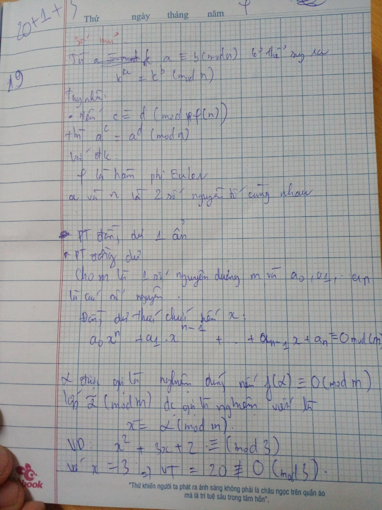
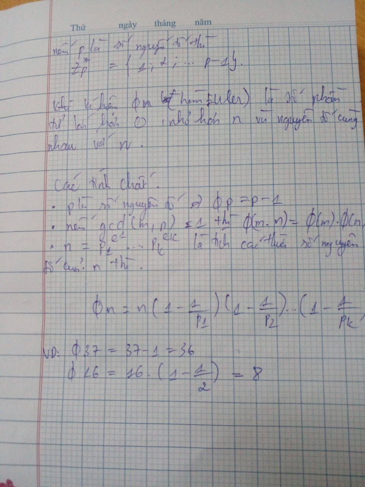
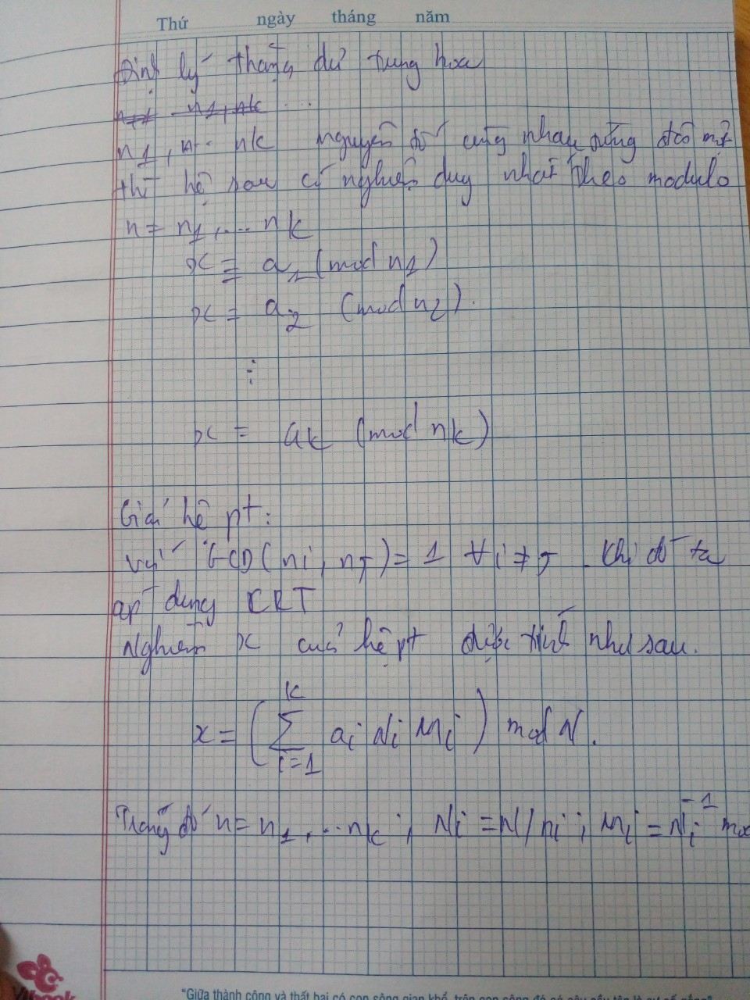
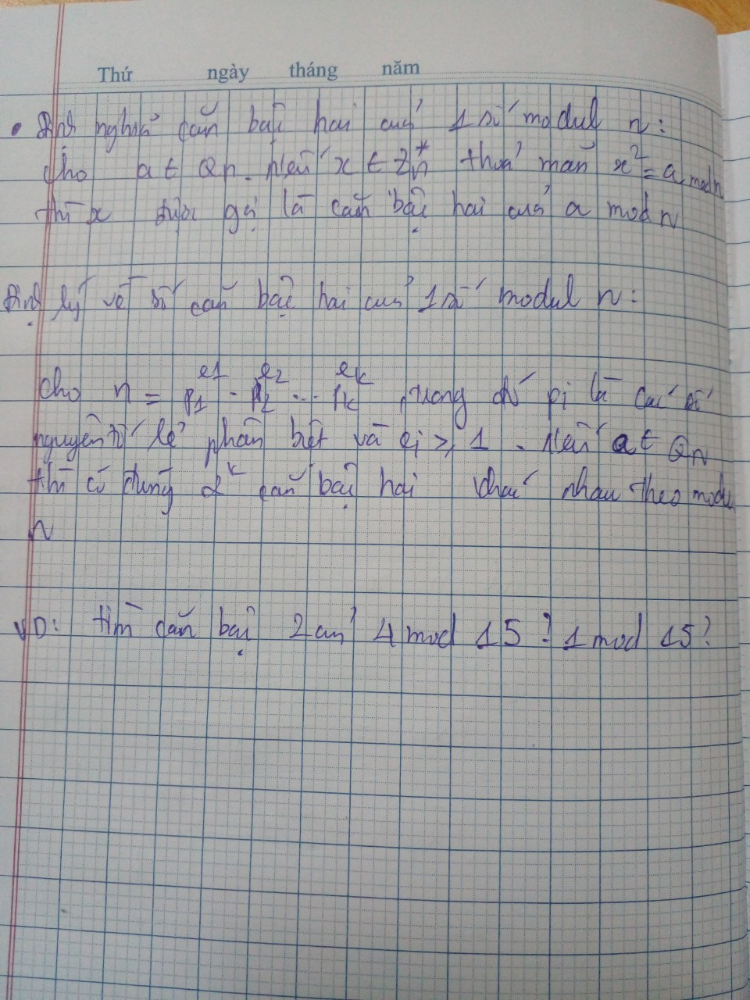

# Tìm hiểu một số khái niệm cơ bản trong Crypto?
***Cryptography***: là một lĩnh vực trong khoa học máy tính liên quan đến việc bảo mật thông tin bằng cách chuyển đổi thông tin thành dạng không đọc được hoặc không thể hiểu được gọi là "mật mã". Mật mã học được sử dụng để bảo vệ thông tin khỏi sự truy cập trái phép và đảm bảo tính bí mật, toàn vẹn và xác thực của thông tin.

ví dụ: từ thời xa xưa, trong các cuộc chiến để cung cấp thông tin cho các chiến tuyến tránh bị lộ chiến lược, người ta đã sử dụng mật mã Caesar để thay đổi văn bản gốc thành văn vản không thể hiểu được bằng cách chuyển vị trí của các chữ cái đi 1 đoạn nhất định:  Ví dụ, nếu ta chọn dịch chuyển 3 vị trí, thì từ "HELLO" sẽ được mã hóa thành "KHOOR"

***Cryptanalysis***: là ngành học nghiên cứu các phương thức để thu được ý nghĩa của thông tin đã được mã hóa. Điều này liên quan đến việc tìm khóa bí mật. Trong ngôn ngữ không kĩ thuật, đây là việc codebreaking hoặc là bẻ khóa code

Ví dụ, giả sử chúng ta có một hệ thống mã hóa đơn giản sử dụng phép dịch chuyển Caesar như đã đề cập trước đó. Người thực hiện cryptanalysis sẽ cố gắng phá vỡ hệ thống mã hóa này bằng cách phân tích văn bản mã và tìm ra quy tắc dịch chuyển

***Encode/Decode***: Encode (mã hóa) và decode (giải mã)

Ví dụ, trong mật mã Caesar thì encode là việc đưa văn bản gốc (HELLO) thành văn bản mã hóa và decode(KHOOR) thì ngược lại.

***Encrypt/Decrypt***: là 2 khái niệm giống với Encode và Decode

**Symmetric and Asymmetric Cryptography** <br>

Symmetric Cryptography: là mã hóa đối xứng,  việc mã hóa và giải mã cùng chung 1 khóa duy nhất.
ví dụ: mã hóa Caesar với việc dịch chuyển là 3 ký tự key = 3 thì khi giải mã ta cũng cần sử dụng key = 3 để dịch chuyển ngược lại là 3 ký tự.

Asymmetric Cryptography: là mã hóa bất đối xứng, việc mã hóa và giải mã không dùng chung 1 khóa.
ví dụ, trong mã hóa RSA thì việc mã hóa ta cần sử dụng khóa công khai là n và e, nhưng khi giải mã cần sử dụng bộ khóa bí mặt n và d, với d được tính toán từ n và e.

***Block Cipher and Stream Cipher***
Block Cipher: là mật mã khối việc tính toán thường trên các ma trận. Một khối plaintext sẽ được chuyển đổi thành một khối ciphertext tương ứng bằng cách áp dụng các phép biến đổi phức tạp như phép hoán vị, thay thế và ánh xạ.

Ví dụ về block cipher phổ biến là Advanced Encryption Standard (AES). AES sử dụng các khối dữ liệu có kích thước 128 bit và có các cấu trúc phức tạp để thực hiện các phép biến đổi trên mỗi khối. Block cipher thường được sử dụng trong các chế độ hoạt động như ECB (Electronic Codebook), CBC (Cipher Block Chaining), và CTR (Counter Mode) để mở rộng việc mã hóa cho dữ liệu có kích thước lớn hơn.

Stream Cipher: là một thuật toán mã hóa hoạt động trên dữ liệu theo dạng dòng liên tục, thay vì chia thành từng khối như block cipher. Thay vì mã hóa từng khối dữ liệu, stream cipher mã hóa từng bit hoặc từng byte của dữ liệu một cách tuần tự. Nó sử dụng một dãy số ngẫu nhiên, gọi là "keystream", và kết hợp nó với dữ liệu plaintext để tạo ra ciphertext.

Ví dụ về stream cipher phổ biến là RC4 (Rivest Cipher 4). RC4 tạo ra một keystream dựa trên một khóa bí mật và sau đó kết hợp nó với dữ liệu plaintext để tạo ra ciphertext. 

**Hash Function**: Hàm băm là một thuật toán được sử dụng để chuyển đổi một tập dữ liệu đầu vào thành một giá trị băm duy nhất, thường có độ dài cố định. Mục đích chính của hàm băm là tạo ra một đại diện duy nhất cho dữ liệu đầu vào sao cho bất kỳ thay đổi nhỏ nào trong dữ liệu đầu vào cũng sẽ dẫn đến thay đổi lớn trong giá trị băm.

ví dụ: hàm băm MD5 có độ dài 128 bit, tức là giá trị băm của nó sẽ có 128 chữ số thập lục phân. Dưới đây là ví dụ về cách sử dụng hàm băm MD5 để băm chuỗi "Hello, world!" thành giá trị băm "5d41402abc4b2a76b9719d911017c592".

# Introduction and General CryptoHack
## Introduction:

### Finding Flags:


submit flag đã cho sẵn để biết được format của flag

### Great Snakes


ở chall này mình cần hiểu được cách chạy một file python <br>
**Để chạy được 1 file python cần:**
- Đầu tiên cần tải python về máy
- có file là ngôn ngữ python có phần đuôi là .py
- Có thể chạy file bằng cmd hoặc ide
- chạy bằng cmd cú pháp `python <tênfile> `

 

flag là : `crypto{z3n_0f_pyth0n}`

### Network Attack


đây là cách kết nối đến sever `nc socket.cryptohack.org 11112
`


tùy các sever mà phương thức trao đổi dữ liệu khác nhau, sever này cho mình thông tin là chỉ đọc được phương thức JSON

**JSON**
- JSON là viết tắt của JavaScript Object Notation, là một kiểu định dạng dữ liệu tuân theo một quy luật nhất định mà hầu hết các ngôn ngữ lập trình hiện nay đều có thể đọc được. JSON là một tiêu chuẩn mở để trao đổi dữ liệu trên web.
- sử dụng các cặp key – value để dữ liệu sử dụng. Nó hỗ trợ các cấu trúc dữ liệu như đối tượng và mảng

example:
```python
{
    "ten": "quan",
    "lop": "AT20N"
}
```
vì chall yêu cầu gửi key là "buy" và value là "flag":


ở đây có thể gửi dữ liệu bằng python thông qua pwntools từ file python mà chall cho sẵn:
```python
#!/usr/bin/env python3

from pwn import * # pip install pwntools
import json

HOST = "socket.cryptohack.org"
PORT = 11112

r = remote(HOST, PORT)


def json_recv():  # hàm nhận dữ liệu về
    line = r.readline()
    return json.loads(line.decode())

def json_send(hsh):
    request = json.dumps(hsh).encode()
    r.sendline(request) 


print(r.readline())
print(r.readline())
print(r.readline())
print(r.readline())

request = {
    "buy": "flag"
}
json_send(request)

response = json_recv()  # nhận dữ liệu mà sever phản hồi

print(response)
```

đây là kết quả khi thực hiện bằng python:


## General
### ENCODING
#### ASCII:


**Bảng mã ASCII**
là bảng mã tiêu chuẩn gồm 256 ký tự bao gồm in được và không in được


 
 tương ứng với các ký tự là vị trí của nó trong bảng mã ví dụ "a" là 97,..

 python đã cũng cấp cho 2 hàm để chuyển đổi qua lại là ord() và chr()

script:
```python
c = [99, 114, 121, 112, 116, 111, 123, 65, 83, 67, 73, 73, 95, 112, 114, 49, 110, 116, 52, 98, 108, 51, 125]
m = [chr(i) for i in c]
print(''.join(m))

```
flag là: `crypto{ASCII_pr1nt4bl3}`

#### Hex


mình cần decode đoạn mã hex trên thành ascii
```python
c = '63727970746f7b596f755f77696c6c5f62655f776f726b696e675f776974685f6865785f737472696e67735f615f6c6f747d'
m = bytes.fromhex(c).decode()
print(m)
```
flag là: `crypto{You_will_be_working_with_hex_strings_a_lot}`

có thể decode trực tiếp trên terminal

ngoài ra có thể decode() bằng các tool online

#### Base64

**base64** là một phương pháp mã hóa dữ liệu dựa trên 64 ký tự trong bảng mã ASCII bao gồm các chữ cái in hoa, in thường, các chữ số 0-9, +, và /
mã base64 luôn đảm bảo có độ dài ký tự chia hết cho 4, vì vậy nếu đoạn mã không đảm bảo thì cần thêm `=` ở cuối 
ví dụ:
"hello" ---> "aGVsbG8=" 


script:
```python
import base64
hex_str = "72bca9b68fc16ac7beeb8f849dca1d8a783e8acf9679bf9269f7bf"
ascii_from_hex = bytes.fromhex(hex_str)
flag = base64.b64encode(ascii_from_hex)
print(flag)
```
result: `b'crypto/Base+64+Encoding+is+Web+Safe/'
`
ta cần đổi lại cho đúng fomat của flag: `crypto{Base+64+Encoding+is+Web+Safe}`

#### Bytes and Big Integers


**script:** <br>
đây là cách sử dụng thư viện <br>
```python
from Crypto.Util.number import long_to_bytes
c = 11515195063862318899931685488813747395775516287289682636499965282714637259206269
m = long_to_bytes(c)
print(m)
```

ngoài ra còn có thể chuyển đổi số nguên sang hex rồi chuyển thành bytes

```python
c = 11515195063862318899931685488813747395775516287289682636499965282714637259206269
m = bytes.fromhex(hex(c)[2:])
print(m)
```

flag là: `crypto{3nc0d1n6_4ll_7h3_w4y_d0wn}`

#### Encoding Challange


mình thử truy cập đến sever 

yêu cầu mình phải decode 

source code chall cho sẵn:
```python
#!/usr/bin/env python3

from Crypto.Util.number import bytes_to_long, long_to_bytes
from utils import listener # this is cryptohack's server-side module and not part of python
import base64
import codecs
import random

FLAG = "crypto{????????????????????}"
ENCODINGS = [
    "base64",
    "hex",
    "rot13",
    "bigint",
    "utf-8",
]
with open('/usr/share/dict/words') as f:
    WORDS = [line.strip().replace("'", "") for line in f.readlines()]


class Challenge():
    def __init__(self):
        self.challenge_words = ""
        self.stage = 0

    def create_level(self):
        self.stage += 1
        self.challenge_words = "_".join(random.choices(WORDS, k=3))
        encoding = random.choice(ENCODINGS)

        if encoding == "base64":
            encoded = base64.b64encode(self.challenge_words.encode()).decode() # wow so encode
        elif encoding == "hex":
            encoded = self.challenge_words.encode().hex()
        elif encoding == "rot13":
            encoded = codecs.encode(self.challenge_words, 'rot_13')
        elif encoding == "bigint":
            encoded = hex(bytes_to_long(self.challenge_words.encode()))
        elif encoding == "utf-8":
            encoded = [ord(b) for b in self.challenge_words]

        return {"type": encoding, "encoded": encoded}

    #
    # This challenge function is called on your input, which must be JSON
    # encoded
    #
    def challenge(self, your_input):
        if self.stage == 0:
            return self.create_level()
        elif self.stage == 100:
            self.exit = True
            return {"flag": FLAG}

        if self.challenge_words == your_input["decoded"]:
            return self.create_level()

        return {"error": "Decoding fail"}


listener.start_server(port=13377)

```
như đã thấy mình decode 100 cái mã điều này không thể thực hiện bằng tay nên mình cần buid 1 script để gửi đến sever

script:
```python 
from pwn import remote
from Crypto.Util.number import long_to_bytes
import base64
import codecs
import json

io = remote("socket.cryptohack.org", 13377)

def json_recv():
    data = json.loads(io.recvline().decode())
    return data["type"], data["encoded"]

def json_send(text):
    io.sendline(json.dumps({"decoded": text}).encode())
for i in range(100):
    encoding, encoded = json_recv()
    if encoding == "base64":
        decoded = base64.b64decode(encoded.encode()).decode() 
    elif encoding == "hex":
        decoded = bytes.fromhex(encoded).decode()
    elif encoding == "rot13":
        decoded = codecs.decode(encoded, 'rot_13')
    elif encoding == "bigint":
        decoded = bytes.fromhex(encoded[2:]).decode()
    elif encoding == "utf-8":
        decoded = ''.join([chr(b) for b in encoded])
    json_send(decoded)


```
ở phần decode big-Int vì ban đầu nó đã mã hóa thành hex chúng ta chỉ cần bỏ đi phần "0x" và decode lại là được


flag là: `crypto{3nc0d3_d3c0d3_3nc0d3}`
### XOR
#### XOR Starter


phép toán xor thực hiện trên các bit cách thực hiện như trong ảnh với các bit giống nhau thì bằng 0, khác nhau là bằng 1, nó thực chất là phép cộng, trừ trên trường hữu hạn Gf($2^8$) 

```python
from pwn import xor
text = b'label'
print(xor(13, text))
```


flag là: `crypto{aloha}`

#### XOR Properties


phép xor có các tính chất giao hoán, kết hợp, xor với chính nó, xor với 0 <br>
mình sẽ vận dụng các tính chất chất trên đưa về dạng FLAG ^ 0 = FLAG

ở đây chỉ cần lấy `FLAG ^ KEY1 ^ KEY2 ^ KEY3 ^ KEY1 ^ (KEY2 ^ KEY3) = FLAG`

script:
```python
from pwn import xor

KEY1 = 'a6c8b6733c9b22de7bc0253266a3867df55acde8635e19c73313'
KEY23 = 'c1545756687e7573db23aa1c3452a098b71a7fbf0fddddde5fc1' # = KEY2 ^ KEY3
FLAG123 = '04ee9855208a2cd59091d04767ae47963170d1660df7f56f5faf' # = FLAG ^ KEY1 ^ KEY3 ^ KEY2 

KEY1 = bytes.fromhex(KEY1)
KEY23 = bytes.fromhex(KEY23)
FLAG123 = bytes.fromhex(FLAG123)

print(xor(FLAG123, xor(KEY1, KEY23)))
```


flag là: `crypto{x0r_i5_ass0c1at1v3}`

#### Favourite byte


ở chall này mình chỉ nhận được 1 mã hex, thông thường format flag là crypto{}
nên mình sẽ thử xor nó với format flag

```python
from pwn import xor

hex_code = '73626960647f6b206821204f21254f7d694f7624662065622127234f726927756d'
c = bytes.fromhex(hex_code)

print(xor(c, b'crypto{'))

```

như đã thấy mình xor với format flag gômf 7 bit thì 7 bit đầu tiên là `\x10` thì đây có thể là key thử xor lại 

```python 
print(xor(c, b'\x10'))
```


flag là: `crypto{0x10_15_my_f4v0ur173_by7e}`

#### You either know, XOR you don't


mình cũng thử xor với form flag


ở đây có thể đọc được là my XOR key ...
mình sẽ thử với key là `myXORkey`


#### Lemur XOR

chall này cho 2 ảnh


ở chall này mình cần thực hiện phép xor ở trên ảnh

script:
```python
from PIL import Image

def xor_images(image1_path, image2_path, output_path):
    # Đọc ảnh đầu vào
    image1 = Image.open(image1_path)
    image2 = Image.open(image2_path)

    # Đảm bảo cùng kích thước
    width = min(image1.width, image2.width)
    height = min(image1.height, image2.height)
    image1 = image1.resize((width, height))
    image2 = image2.resize((width, height))

    # Tạo ảnh kết quả
    result_image = Image.new('RGB', (width, height))

    # Lặp qua từng điểm ảnh và XOR các bit RGB
    for x in range(width):
        for y in range(height):
            pixel1 = image1.getpixel((x, y))
            pixel2 = image2.getpixel((x, y))
            xor_pixel = tuple(p1 ^ p2 for p1, p2 in zip(pixel1, pixel2))
            result_image.putpixel((x, y), xor_pixel)

    # Lưu ảnh kết quả
    result_image.save(output_path)

# Ví dụ sử dụng
image1_path = 'flag_7ae18c704272532658c10b5faad06d74.png'
image2_path = 'lemur_ed66878c338e662d3473f0d98eedbd0d.png'
output_path = 'output.png'

xor_images(image1_path, image2_path, output_path)
```

và đây là kết quả:


flag là: `crypto{X0Rly_n0t!}`

### MATHEMATICS
#### Greatest Common Divisor


mình sẽ buid 1 hàm dùng thuật tóan Euclid

```python
def gcd(a, b):
    while 1:
        a, b = b, a % b
        if b == 0:
            return a
        
print(gcd(66528, 52920)) 
# =1512
```
ngoài ra có thể sử dụng hàm có sẵn trong sagemath


flag là: `crypto{1512}`

#### Extended GCD


Thuật toán Euclid mở rộng giúp ta tính toán nghịch đảo modul

```python
def extended_euclid(a, b):
    if b == 0:
        return 1, 0

    x, y = extended_euclid(b, a % b)

    c = x
    x = y
    y = c - (a // b) * y

    return x, y
p = 26513 
q = 32321
print(extended_euclid(p, q))
```

 <br>
ngoài ra có thể sử dụng sage math, hoặc các thư viện có sẵn

flag là: `crypto{-8404}`

#### Modular Arithmetic 1


bài toán chia lấy dư

<br>
flag là `crypto{4}`

####  Modular Arithmetic 2


vận dụng định lí Fermat nhỏ

vì p là số nguyên tố và không phải là ước của a nên mình vận dụng định lý Fermat nhỏ
--> kết quả = 1

flag là: `crypto{1}`

#### Modular Inverting
Bài toán nghịch đảo modul
Điều kiện để có nghịch đảo là 2 số là 2 số nguyên tố cùng nhau. 
sử dụng thuật toán Euclid mở rộng để tính:
```python
def modulo_inverse(a, b):
    if b == 0:
        return 1, 0

    x, y = extended_euclid(b, a % b)

    c = x
    x = y
    y = c - (a // b) * y

    return x % y

print(modulo_inverse(3, 13))  # =9
```

ngoài ra còn có thể sử dụng hàm pow()


flag là: `crypto{9}`


### DATA FORMATS
#### Privacy-Enhanced Mail?


thông tin về khóa RSA được mã hóa bằng PEM 
>  là định dạng phổ biến nhất cho X, 509 giấy chứng nhận, CSRs và khóa mật mã. Tệp PEM là tệp văn bản chứa một hoặc nhiều mục trong mã hóa Base64 ASCII, mỗi mục có đầu trang và chân trang văn bản đơn giản (ví dụ: -----BEGIN CERTIFICATE----- và -----END CERTIFICATE-----). Một tệp PEM duy nhất có thể chứa một chứng chỉ thực thể cuối, một khóa riêng tư hoặc nhiều chứng chỉ tạo thành một chuỗi tin cậy hoàn chỉnh. Hầu hết các tệp chứng chỉ được tải xuống từ SSL.com sẽ ở định dạng PEM.

giờ mình sẽ lấy khóa bí mật d của mã RSA
```python
from Crypto.PublicKey import RSA

with open('privacy_enhanced_mail_1f696c053d76a78c2c531bb013a92d4a.pem', 'r') as f:
    data = f.read()
    
rsa = RSA.importKey(data)

print(int(rsa.d))
```


flag là `15682700288056331364787171045819973654991149949197959929860861228180021707316851924456205543665565810892674190059831330231436970914474774562714945620519144389785158908994181951348846017432506464163564960993784254153395406799101314760033445065193429592512349952020982932218524462341002102063435489318813316464511621736943938440710470694912336237680219746204595128959161800595216366237538296447335375818871952520026993102148328897083547184286493241191505953601668858941129790966909236941127851370202421135897091086763569884760099112291072056970636380417349019579768748054760104838790424708988260443926906673795975104689`

#### CERTainly not


SSL Certificate là chứng chỉ SSL. Chứng thư số SSL cài trên website của bạn cho phép khách hàng khi truy cập có thể xác minh được tính xác thực, tin cậy của website, đảm bảo mọi dữ liệu, thông tin trao đổi giữa website và khách hàng được mã hóa. Điều này tránh nguy cơ thông tin bị can thiệp, rò rỉ. 

DER (Quy tắc mã hóa khác biệt) là ***một mã hóa nhị phân*** cho X, 509 Giấy chứng nhận và khóa riêng. Không giống như PEM, các tệp được mã hóa DER không chứa các câu lệnh văn bản đơn giản như -----BEGIN CERTIFICATE-----. Các tệp DER thường thấy nhất trong các bối cảnh Java.

vì định dạng PEM sẽ encode base64 cho bước cuối cùng nên mình sẽ đọc file DER và chuyển nó về base64 thêm phần đầu và phần cuối và định dạng guống file PEM

```python 
from Crypto.PublicKey import RSA
import base64
with open('2048b-rsa-example-cert_3220bd92e30015fe4fbeb84a755e7ca5.der', 'rb') as f:
    data = f.read()
base64_data = base64.b64encode(data).decode()

pem_data = '-----BEGIN CERTIFICATE-----\n'
pem_data += '\n'.join([base64_data[i:i+64] for i in range(0, len(base64_data), 64)])
pem_data += '\n-----END CERTIFICATE-----\n'

print(pem_data)
rsa = RSA.importKey(pem_data)
print(rsa.n)
```


flag là: `22825373692019530804306212864609512775374171823993708516509897631547513634635856375624003737068034549047677999310941837454378829351398302382629658264078775456838626207507725494030600516872852306191255492926495965536379271875310457319107936020730050476235278671528265817571433919561175665096171189758406136453987966255236963782666066962654678464950075923060327358691356632908606498231755963567382339010985222623205586923466405809217426670333410014429905146941652293366212903733630083016398810887356019977409467374742266276267137547021576874204809506045914964491063393800499167416471949021995447722415959979785959569497`

#### SSH Keys
để lấy được n (modul) mình làm tương tự như trên

```python
from Crypto.PublicKey import RSA

f = open('bruce_rsa_6e7ecd53b443a97013397b1a1ea30e14.pub','r')
rsa = RSA.importKey(f.read())
print(rsa.n)
```


#### Transparency

Giao thức TLS (Transport Layer Security) là một giao thức bảo mật được sử dụng để bảo vệ thông tin khi truyền qua mạng. Nó là phiên bản cải tiến, nâng cấp của giao thức SSL (Secure Sockets Layer)

để tìm miền phụ của `cryptohack.org` mình sử dụng trang web crt.sh 


thấy có đường dẫn `thetransparencyflagishere.cryptohack.org` paste vô xem thử 


flag là: `crypto{crypto{thx_redpwn_for_inspiration}}`

# Một số kiến thức toán học

          .jpg>)                  


        ---------------------finish----------------------